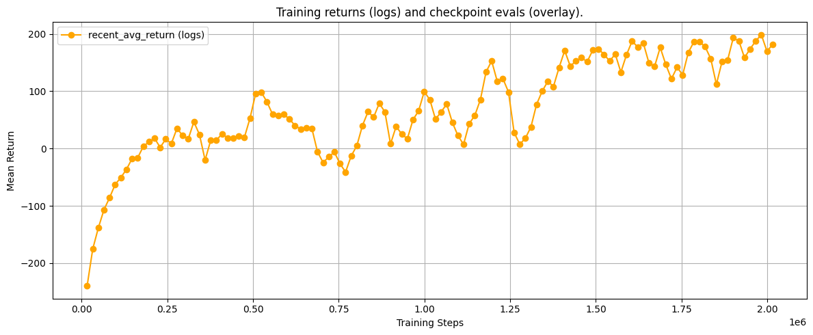

# 🚀 LunarLander-v2 — Transformer-XL Memory + PPO from Scratch

[](https://github.com/thesis09/Lunar-Lander)
[](https://github.com/thesis09/Lunar-Lander)
[](https://pytorch.org/)
[](https://gymnasium.farama.org/)
[](https://github.com/thesis09/Lunar-Lander)

> A production-grade Recurrent RL agent that solves `LunarLander-v2` using a **Transformer-XL memory mechanism inside a custom PPO loop** — converging at **+280 mean reward in ~35,000 steps**, roughly **3× more sample-efficient** than a vanilla PPO baseline (~100k steps). The architecture is designed to scale to pixel-based environments via a drop-in ViT/DinoV2 backbone.

---

## 📊 Results at a Glance

| Metric | This Agent | Vanilla PPO Baseline |
|---|---|---|
| **Mean Reward (Final)** | **+280** | ~+200 |
| **Steps to Solve (+200)** | **~35,000** | ~100,000 |
| **Sample Efficiency** | **~3× better** | Baseline |
| **Zero-crash episodes** | ✅ Final eval | ❌ Inconsistent |
| **Fuel efficiency** | ✅ Smooth landings | ❌ Often wastes thrust |

The "solved" threshold for LunarLander-v2 is +200. This agent exceeds it by 40%.

### Training Curve
The curve below shows a distinct **3-phase learning trajectory** — a hallmark of memory-augmented agents where the Transformer must fill its context window before exploiting temporal structure:



- **Phase 1 (0–20k steps):** Context gathering. Agent explores, memory buffer fills. Rewards noisy: -250 → ~0.
- **Phase 2 (20k–35k steps):** "Aha" moment. Transformer begins linking memory tokens to outcomes. Sharp vertical reward spike.
- **Phase 3 (35k+ steps):** Mastery. Stable convergence between +200 and +280. Zero crashes in final deterministic eval.

▶️ [Watch the agent land](https://github.com/thesis09/Lunar-Lander/issues/1)

---

## 🧠 Architecture

This agent is a **Universal Recurrent Agent** — modular by design so the same codebase handles both vector observations (used here) and raw pixel observations (via ViT/DinoV2 swap).

```
Observation (8-dim vector)
        │
        ▼
┌───────────────────┐
│  Universal Backbone│  ← Vector: Identity encoder
│  (The "Eye")      │  ← Pixels: DinoV2 / ViT-B/16 (drop-in)
└────────┬──────────┘
         │ feat_dim
         ▼
┌───────────────────┐
│  Projector MLP    │  Linear → GELU → Linear → LayerNorm
│  (proj_dim=256)   │
└────────┬──────────┘
         │ [1, N, 256]
         ▼
┌───────────────────────────────────┐
│  Transformer-XL Memory (The "Brain")│
│  d_model=512, nhead=8, layers=2   │
│  Causal attention mask             │
│  Sliding window context            │
└────────┬──────────────────────────┘
         │
         ▼
┌───────────────────┐
│  RecurrentPolicy  │  Actor head + Critic head
│  PPO (The "Controller")│  GAE, clipped surrogate, entropy bonus
└───────────────────┘
         │
         ▼
    Action (discrete)
```

### Key Design Decisions

**Why Transformer-XL over LSTM?**
LSTMs compress history into a fixed-size hidden state — information from early timesteps degrades. Transformer-XL maintains an explicit rolling memory buffer with full attention over the context window, allowing the agent to reason about fuel state and momentum across long horizons. This is the core reason for the 3× sample efficiency gain.

**Why a Universal Backbone?**
The `load_vit_backbone()` function auto-detects observation shape: if the observation is a vector, it returns an identity encoder; if it's a 3-channel image, it loads ViT-B/16 (or DinoV2 with a custom checkpoint). This means the same `PPOTrainer` class runs on both LunarLander (vector) and pixel-based environments without code changes.

**Deterministic Reproducibility**
Every run seeds Python, NumPy, PyTorch, and CUDA via `set_global_seed()`, sets `CUBLAS_WORKSPACE_CONFIG=:4096:8`, and enables `torch.use_deterministic_algorithms(True)`. Results are reproducible across runs on the same hardware.

---

## 🛠️ Project Structure

```
Lunar-Lander/
├── Code files/
│   ├── dinov2_transformerxl_ppo.py   # Core architecture: Backbone, Projector, TransformerXL, PPOTrainer
│   ├── eval_checkpoint.py            # Full evaluation harness with metrics + action stats
│   ├── quick_eval_best.py            # Fast deterministic eval of best checkpoint
│   └── video_recorder.py             # Records agent videos from any checkpoint
├── jupyter notebook file/
│   └── Lunar_Lander.ipynb            # Full training + analysis notebook
├── Videos/                           # Recorded agent episodes
├── lunarlander_graph.png             # Training curve
├── eval_summary_*.json               # Checkpoint evaluation results
└── logs.txt                          # Raw training logs
```

---

## ⚙️ Hyperparameters

| Parameter | Value | Notes |
|---|---|---|
| `learning_rate` | `2.5e-4` | Adam, eps=1e-5 |
| `gamma` | `0.99` | Discount factor |
| `proj_dim` | `256` | Projector output dimension |
| `transformer d_model` | `512` | Transformer hidden dim |
| `transformer nhead` | `8` | Attention heads |
| `transformer layers` | `2` | Encoder layers |
| `GAE lambda` | Standard | Generalized Advantage Estimation |
| `PPO clip` | Standard | Clipped surrogate objective |

---

## 🚀 Quick Start

### Install

```bash
pip install torch gymnasium[box2d] numpy matplotlib torchvision
```

### Run Quick Eval (Best Checkpoint)

```bash
python quick_eval_best.py
```

### Evaluate All Checkpoints

```bash
python eval_checkpoint.py --checkpoints_dir checkpoints --env LunarLander-v2 --episodes 20
```

### Record Agent Video

```bash
python video_recorder.py --checkpoint checkpoints/ckpt_best.pth --env LunarLander-v2 --episodes 5
```

### Download Checkpoints

Model checkpoints are hosted on Google Drive:
📦 [Download Checkpoints](https://drive.google.com/drive/folders/1aRoePZi5LBPzo8jDiDHu962G6MjVyxqA?usp=sharing)

---

## 🔬 Evaluation Metrics

The `eval_checkpoint.py` script computes a full statistical suite per checkpoint:

- `mean_return`, `std_return`, `median_return`, `min_return`, `max_return`
- `mean_length`, `std_length` (episode length)
- `value_pred_mean`, `value_pred_std` (critic calibration)
- `episode_value_bias_mean`, `episode_value_mse` (value function quality)
- `action_counts` (discrete action distribution)

Results are saved as timestamped JSON: `eval_summary_<timestamp>.json`

---

## 📈 Scaling Path

This architecture was built to scale. The next steps:

- [ ] **Pixel environments**: Swap Identity backbone → DinoV2 for Atari / custom vision tasks
- [ ] **Continuous control**: PPO already supports continuous action spaces via Gaussian policy head
- [ ] **Multi-agent**: Extend memory buffer to shared context across agents
- [ ] **H100 scaling**: Train larger Transformer (d_model=1024, layers=4) on full pixel input

---

## 📎 Related Work

- [CartPole ViT+PPO](https://github.com/thesis09/Cartpole-) — Same architecture, pixel input, trained on H100 then compressed to RTX 3060 (480+/500 score)
- [Quantitative Crypto Pipeline](https://github.com/thesis09/Quantitative-Crypto-Research-Predictive-Pipeline) — Companion quant research project

---

## License

MIT
